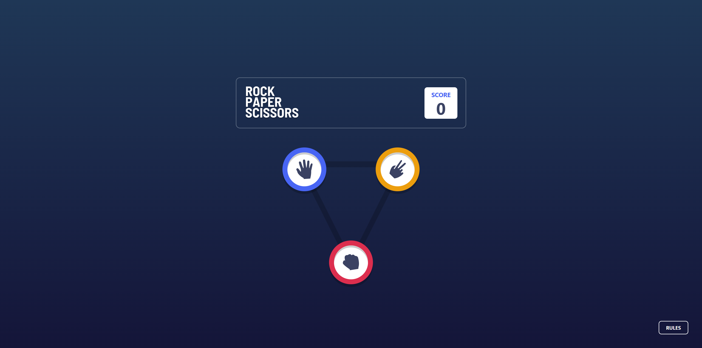
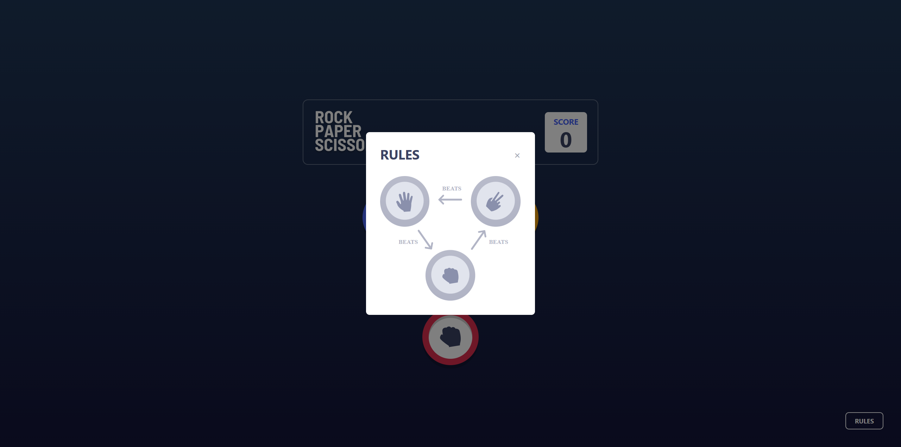

🪨📄✂️ Rock, Paper, Scissors (React + Tailwind)

A modern, responsive implementation of the classic game, built as a Frontend Mentor challenge. This project focuses on state management, reusable components, and utility-first styling.

Overview

The challenge
Users should be able to:

View the optimal layout for the game depending on their device's screen size.

Play Rock, Paper, Scissors against the computer.

Maintain the state of the score after refreshing the browse.

Screenshot of the main page with the rules model

🚀 The Tech Stack
Framework:  (Vite)

Styling: Tailwind CSS

🛠️ Technical Highlights(for main page)
1. Reusable "Token" Component
Instead of hardcoding the HTML for each game piece, I built a dynamic Token.jsx component. This allows me to pass in props for the icon, the specific border color, and its absolute position on the triangle.

2. Complex Positioning with Tailwind
To match the design's triangle layout, I used a relative parent container with absolute children. I leveraged Tailwind's arbitrary values (e.g., border-[15px]) to match the style guide's exact specifications.

3. State-Driven Modals
The "Rules" overlay is handled via Conditional Rendering. I used a boolean state (showRules) to toggle the modal's visibility, ensuring a smooth user experience without needing external libraries.

🧠 What I Learned
HSL in Tailwind: Mastering the text-[hsl(229,25%,31%)] syntax (and learning the hard way that spaces inside the brackets break the compiler!).

Portal-like Modals: Using fixed inset-0 and z-index to create a focused UI overlay.

Clean Code: Moving components out of the render cycle to prevent performance issues and "Uncaught SyntaxErrors."